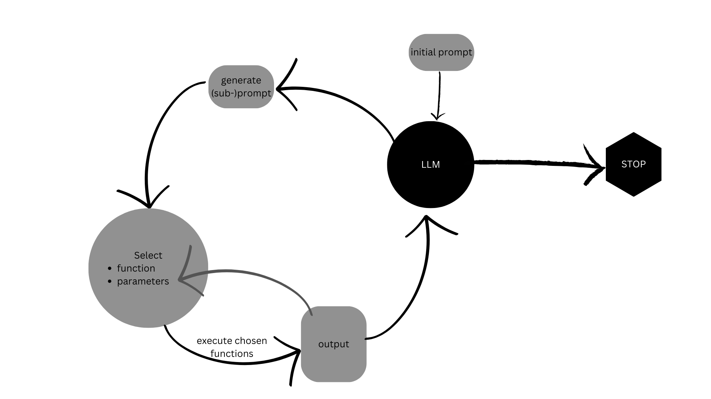

# WebAPI Query Planning Using LLMs

The LLM is prompted to find recipes depening on some specifications (such as dietarian restrictions or maximal cooking time), pair wines to a dish or dishes to a wine, retrieve offers for fruit and veg or wines from a (virutal) supermarked or look up which items are in the (virtual) fridge.  
35 prompts have been selected and run with GPT 3.5-Turbo and GPT 4-Turbo in the second iteration of experiments. Results can be found here: https://wandb.ai/misssophie/LLM_multi_step_query/reports/WebAPI-Query-Planning-Using-LLMs--Vmlldzo3NTQyMDcx?accessToken=isvo4woevdpg3enta77w4n1videztgvxppm76so066joi2ewyd65rumol6ncctbt  

The goal of this project is to test out different LLM's capabilities of query planning by successively increasing the complexity of tasks in the domain of meal planning.  

  

Complexity can be:
* Length: Number of steps that need to be executed
* Chaining: Output to be used as input in later steps
* Vagueness in prompts
* Reasoning: Comparing different outputs, also assessing contradictory or illogical results (e.g. interpretation of wrong results or unexpected API behaviour)
* Multi-lingual: Results can be in German or English, inputs need to be in English (translation needed when using previous outputs)
